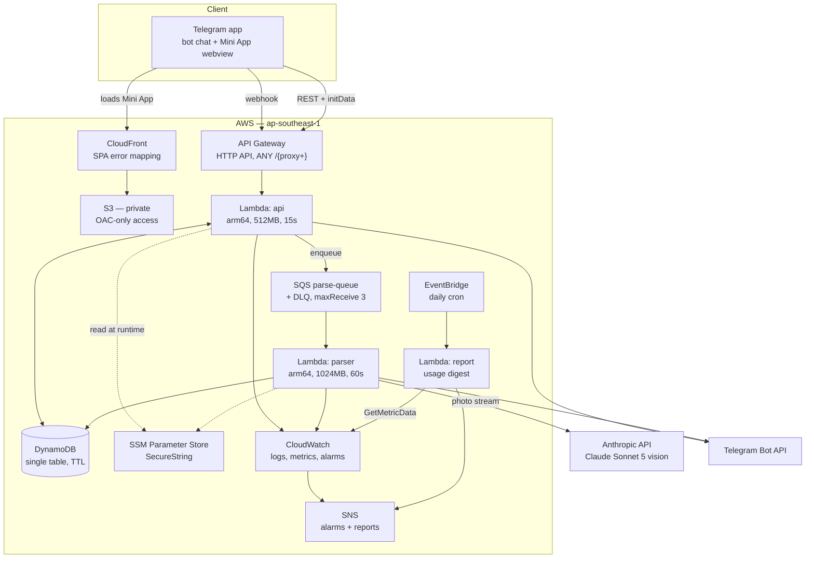
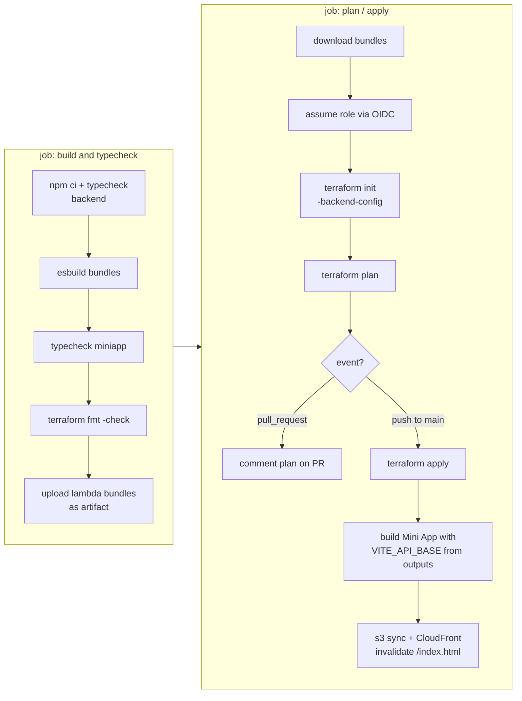
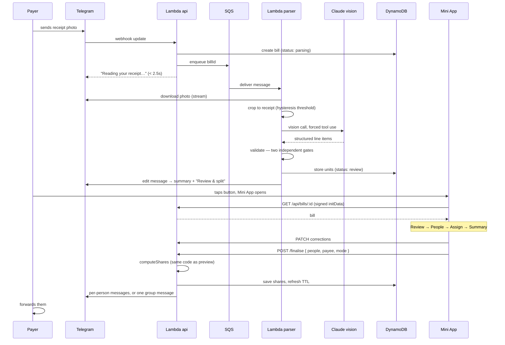
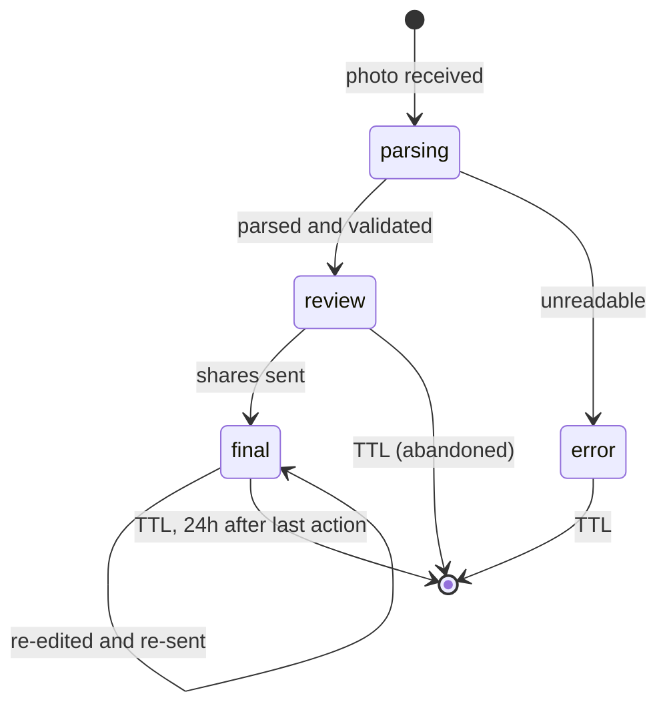

# AnySplit — Design

A Telegram bot that splits a restaurant bill from a photo of the receipt.

One person photographs the receipt. A vision model reads it into structured
line items, in whatever currency is printed. They assign each item to a name in
a Telegram Mini App, and AnySplit returns a per-person total with service
charge and tax folded in proportionally — either as one message per person to
forward, or a single consolidated message to paste into a group chat.

Built for Singapore, where a bill might stack 10% service charge and then 9%
GST, or have neither. Both are read off the receipt rather than configured. A
receipt in another currency — JPY, MYR, and a dozen others — is read the same
way; SGD is only a default for when the receipt itself gives no indication.

This document is the design rationale: how AnySplit is put together and why
each decision went the way it did. [README.md](README.md) is the operational
counterpart — running, deploying, and debugging it — and
[infra/README.md](infra/README.md) covers the Terraform specifics.

---

## 1. Technical architecture



### What is infrastructure, what is application code

Everything below is declared in Terraform. Nothing is created by hand except
the two bootstrap items noted at the bottom.

| AWS resource | Terraform file | Role |
|---|---|---|
| Lambda `anysplit-api` | `lambda.tf` | Telegram webhook + REST API for the Mini App |
| Lambda `anysplit-parser` | `lambda.tf` | SQS consumer; calls the vision model |
| Lambda `anysplit-report` | `report.tf` | EventBridge cron; mails the daily usage digest |
| API Gateway HTTP API | `apigw.tf` | `ANY /{proxy+}`, `$default` stage, CORS |
| DynamoDB `anysplit-bills` | `dynamodb.tf` | Single table, TTL enabled |
| SQS `parse-queue` + DLQ | `sqs.tf` | Decouples the slow vision call from the webhook |
| S3 + CloudFront | `s3.tf`, `cloudfront.tf` | Static Mini App, private bucket, OAC only |
| SSM Parameter Store | `main.tf` | Bot token, webhook secret, user-reference HMAC key. **No Anthropic key** |
| IAM roles | `iam.tf` | One least-privilege role per Lambda |
| OIDC provider + CI role | `github_oidc.tf` | Keyless deploys from GitHub Actions |
| Log groups, metric filters, alarms, SNS | `monitoring.tf`, `lambda.tf` | Observability |

| Application code | Language | Role |
|---|---|---|
| `shared/` | TypeScript | Types, money, currency, calc, payee — imported by **both** backend and Mini App |
| `backend/src/handlers/` | TypeScript | Three Lambda entrypoints: `api`, `parser`, `report` |
| `backend/src/lib/` | TypeScript | Bot, vision, preprocessing, DB, formatting, logging, auth |
| `miniapp/src/` | React + Vite + Tailwind | Four-screen Mini App, static build |
| `scripts/parse.ts` | TypeScript | Offline harness for measuring parse accuracy |

Created out-of-band, because they cannot bootstrap themselves: the **S3 state
bucket** (Terraform cannot create its own backend) and the **three SSM
SecureStrings** — bot token, webhook secret, and user-reference HMAC key —
which are deliberately kept out of Terraform state (see §4). There is no
Anthropic key among them: the parser federates its IAM role instead.

### Why this shape

**Two Lambdas, not one.** Telegram redelivers a webhook if it is not
acknowledged in about five seconds. A vision call takes far longer than that.
The `api` Lambda therefore does only fast work — validate, persist, enqueue,
reply — and the `parser` Lambda does the slow work behind SQS. Merging them
would produce duplicate updates and duplicate charges on the Anthropic API.

**`shared/` is imported by the front end on purpose.** The Mini App's Summary
screen previews per-person totals using the *same* `computeShares` the server
runs on finalise, so what the payer approves is exactly what gets sent. Two
copies of that arithmetic would eventually disagree by a cent, and the bug
would surface as an accusation between friends.

**arm64 across all three functions.** Cheaper per millisecond, and nothing in
the dependency tree is native.

**No custom domain.** CloudFront's `*.cloudfront.net` and API Gateway's
`*.execute-api.*` both carry valid certificates, which is all Telegram
requires — so ACM, Route 53, and a `us-east-1` provider alias are all absent
by design rather than by omission.

---

## 2. CI/CD design

### Repository structure

```
AnySplit/
├── shared/               types, money, calc — imported by BOTH sides
├── backend/              three Lambda bundles, built with esbuild
│   ├── src/handlers/     api.ts, parser.ts, report.ts — the entrypoints
│   └── src/lib/          bot, vision, preprocess, db, ratelimit, format, log, auth
├── miniapp/              React + Vite + Tailwind, static
├── infra/                Terraform, one file per concern
├── scripts/parse.ts      accuracy harness
└── .github/workflows/    ci.yml
```

A monorepo, because `shared/` has to be a single source of truth. Splitting
the backend and Mini App into separate repositories would mean versioning
`shared/` as a package and would reintroduce exactly the drift it exists to
prevent.

### Pipeline

Pushing to `main` deploys. A pull request plans and applies nothing.



| Stage | Why it exists |
|---|---|
| Typecheck before bundling | esbuild strips types without checking them; without this step a type error ships |
| Lambda bundles as a job artifact | The zips are inputs to `terraform plan`. Rebuilding them in the second job would produce different hashes and a spurious code diff |
| `terraform fmt -check` | Formatting arguments belong in CI, not in review |
| Plan-as-PR-comment | Infrastructure review happens on the diff of *effects*, not only the diff of HCL |
| Mini App built **inside** the job holding the outputs | See below — this one is scar tissue |
| CloudFront invalidation of `/index.html` only | Hashed assets are immutable and cached forever; only the entrypoint must be invalidated |

**Why the Mini App is built inside the deploy job.** `VITE_API_BASE` is baked
into the bundle at build time. A locally-built bundle once shipped with it
empty: an AWS session had expired mid-build, `terraform output` failed quietly,
and the empty string meant every API call went same-origin and came back as
CloudFront's SPA fallback — `index.html` where JSON was expected. The Mini App
reported "the server sent an unexpected response" and nothing worked.
`vite.config.ts` now refuses to build without the variable, and CI takes the
value directly from the state it has just applied.

### Deployment security

No long-lived AWS credentials exist in GitHub. Each job mints a short-lived
OIDC token, AWS verifies it against the account's provider, and STS returns
credentials good for that run only.

Two properties are deliberate:

**The trust policy pins two exact subjects** — `main` and `pull_request` —
rather than `repo:owner/name:*`. A wildcard also matches every branch, tag and
environment, so anyone able to push a branch could apply infrastructure.

**The subject is matched on numeric IDs.** GitHub issues an immutable subject
claim:

```
repo:owner@<owner-id>/name@<repo-id>:ref:refs/heads/main
```

not the `repo:owner/name:...` form most documentation shows. The IDs are the
point: GitHub names can be released and re-registered, so a policy matching
names alone would keep trusting the repository path after somebody else
claimed it. This surfaced as a bare `Not authorized to perform
sts:AssumeRoleWithWebIdentity`; CloudTrail's record of the subject actually
presented is what identified it.

**The role's permissions are scoped to the `anysplit-*` prefix.** IAM write is
the dangerous part — a role that can create roles can escalate — so it cannot
touch anything outside that prefix, and `PassRole` is further conditioned on
`lambda.amazonaws.com`. There is no `dynamodb:DeleteTable`: every bill in
flight lives in that table, and a change forcing its replacement should fail in
CI and be carried out by a human.

Because this repository is public, `AWS_ROLE_ARN` and `TF_STATE_BUCKET` are
**secrets rather than variables**. Neither is truly confidential, but Actions
echoes step inputs into logs, public repository logs are readable by anyone,
and both values embed the AWS account ID. Secrets are masked; variables print
verbatim.

**Fork pull requests skip the Terraform job entirely.** A fork PR receives a
read-only token and cannot mint an OIDC credential, so the job would fail
confusingly rather than dangerously. Skipping it means a contributor sees a
clean build instead.

---

## 3. Application flow



### Bill lifecycle



### The four screens

| Screen | Purpose |
|---|---|
| **Review** | Merchant, line items and total, all editable. The model proposes; the payer confirms |
| **People** | Who is splitting |
| **Assign** | Tap a person, tap their items. Multiple people on one item splits it |
| **Summary** | Per-person totals, who is collecting, and the two send options |

### API surface

| Route | Purpose |
|---|---|
| `POST /webhook` | Telegram updates. Requires the secret-token header |
| `GET /api/bills/:id` | Load a bill. Admin only |
| `PATCH /api/bills/:id` | Corrections from the Review screen |
| `POST /api/bills/:id/finalise` | Compute shares and send. Repeatable |
| `OPTIONS /*` | CORS preflight |
| `GET /health` | Liveness |

`OPTIONS /*` is explicit because API Gateway's `ANY /{proxy+}` route swallows
preflights and hands them to the application, which otherwise answers 404 and
the browser reports it as an opaque CORS failure.

### Data model

One DynamoDB table, no sort key, no GSI. Every bill read is a single `GetItem`.
The authoritative shape is [`shared/types.ts`](shared/types.ts); what matters
architecturally is which fields are derived and which are decoration.

| Field | Note |
|---|---|
| `billId` | Partition key. 12-char base64url |
| `adminId` | Telegram id of the payer. The only user allowed to read or mutate the bill |
| `currency` | ISO 4217 code read off the receipt. Defaults to `SGD` — for the placeholder written before the vision call returns, and for bills written before multi-currency support existed at all |
| `subtotal` | The sum of `units` — **not** the receipt's printed subtotal |
| `total` | What was actually paid, in cents |
| `factor` | `total / subtotal`. The only non-integer in the item, because it is a ratio, not money |
| `units` | Quantities already expanded, one row per unit |
| `shares` | Populated on finalise, and rewritten on every re-finalise |
| `ttl` | Epoch seconds. Re-checked on read |
| `serviceCharge`, `gst`, `discount` | As printed. **Display only** — no calculation reads them |
| `note` | Parse warning or error, surfaced in the Mini App |

`subtotal` being the sum of units rather than the printed figure is the
load-bearing choice: `factor` has to be relative to what actually gets divided
up, or the shares will not add to the total. When the two disagree the parse still
lands, `note` says so, and the payer reconciles it in the Review screen.

Two other item shapes share the table rather than earning tables of their own:
`upd#<update_id>`, written conditionally with a one-hour `ttl` to dedupe
Telegram's webhook retries, and the rate-limit counters described below, keyed
by window start so they expire themselves. A second table for either would be
pure ceremony.

---

## 4. Design considerations

### The four invariants

Everything else follows from these.

1. **All money is an integer count of the bill's currency's minor unit.** No
   floats in the database, the API, or the model's output. Every field still
   named `cents` predates multi-currency support and keeps the name — for SGD,
   USD and friends that minor unit really is a cent, but for JPY, KRW, VND and
   IDR there's no minor unit in practical use, so the integer *is* the amount
   (`shared/currency.ts`'s `minorDigits: 0`). Formatting to a currency's own
   convention happens only at render time. A float bug did get through early —
   `Number("1.005") * 100` yields `100.4999…` — and it was caught by a real
   receipt, which is why parsing is decimal, not multiplied.

2. **The grossing factor is derived, never configured.**
   `factor = total / subtotal`, applied to each person's item sum. That one
   line covers service-charge-then-GST stacking, GST-only venues, hawker
   receipts with neither, and flat discounts, with no branching and no
   per-venue settings.

3. **Quantities are expanded into units.** `2x Beer $12.00` is stored as two
   rows of `$6.00`, so giving one beer to each of two people needs no fraction
   UI and no special case.

4. **Cents are reconciled.** After rounding each person to whole cents, the
   one- or two-cent remainder goes to the largest share, so the shares sum to
   exactly what was paid. A split that does not add up is worse than useless.

And one rule about people: **a model proposes, the admin confirms.** Every
field the vision call produces is editable before anything is sent.

### Getting the parse right

The vision call is the highest-risk part of the system, so it was measured
before anything was built around it — `scripts/parse.ts` runs real receipts and
reports how many reconcile.

| Model | Raw phone photos | Cropped |
|---|---|---|
| Haiku 4.5 | 3/9 | 5/9 |
| Sonnet 5 | 6/9 | 8/9 |

Two things came out of that. **Cropping matters more than model choice** — the
receipt is isolated from the background before the call, which improves
accuracy *and* reduces cost, since image tokens scale with area. The crop uses
a hysteresis threshold (seed on confident bright pixels, grow into connected
dimmer ones) after a single fixed threshold was found to be truncating
receipts whose totals block fell into shadow.

**Rotation, by contrast, is a red herring.** Correcting EXIF orientation alone
changed nothing — 3/9 either way — so there is deliberately no deskew logic.
Jimp applies the EXIF tag on read, and that turned out to be sufficient.

Two caveats worth carrying: `temperature` is deprecated on Sonnet 5 and later
and returns a 400, so the run cannot be pinned down and marginal receipts vary
between runs; and n=9 is a small sample, not meaningfully distinguishable from
the 9/10 target it was measured against. The one consistent failure is a
receipt whose thermal print has faded to where `$10.00` and `$70.00` are
genuinely ambiguous to a careful human — which no model or preprocessing fixes,
and which is precisely what the Review screen exists for.

**Structured output is forced**, via a tool schema with `strict: true`, rather
than parsed out of prose.

Two independent validation gates then run:

- `reconcilesToSubtotal()` — do the line items sum to the printed subtotal?
- `summaryDelta()` — does `subtotal − discount + service + GST` equal the
  total, within five cents?

The second exists because the first cannot catch an invented total. When a
crop truncated the totals block, the model produced a plausible, wrong total
that reconciled perfectly against the items it could see.

### Reading the currency

The vision call reports a currency alongside the amounts — read from a symbol,
a code, or context like the merchant's address — defaulting to SGD only when
the receipt gives no indication either way. That default matters: most photos
this bot receives are Singaporean, and a wrong guess of "foreign" would be a
worse failure mode than a wrong guess of "local."

**A fixed allowlist, not whatever the model says.** `shared/currency.ts` holds
symbol, decimal convention, and tax label for about fifteen currencies likely
to show up on a receipt someone in or travelling from Singapore photographs.
The tool schema's `currency` field enums against exactly that list, so a
currency reaching the rest of the system is always one AnySplit knows how to
format — the same reasoning as the fixed rate-limit tiers, applied to a
different kind of unbounded input. A response outside the list — a schema
violation `strict: true` shouldn't allow, but defence in depth costs one
`if` — logs a warning and falls back to SGD rather than failing the parse.

**Zero-decimal currencies are a real case, not an edge case.** JPY, KRW, VND
and IDR have no minor unit in ordinary use — ¥500 is ¥500, not ¥5.00 — so
`shared/money.ts`'s cent-handling functions all take a `minorDigits` parameter
rather than assuming two. The Mini App's price and total inputs are
uncontrolled (`defaultValue`, not `value`, so typing isn't fought by a
re-render on every keystroke), which means they only pick up a new
`minorDigits` on mount — so they're keyed on the currency, deliberately
remounting if the admin corrects it after typing a price.

**"GST" is a Singapore fact, not a universal one.** Malaysia has SST, most of
the rest of the world has VAT or a generic sales tax, and guessing which one a
foreign receipt actually printed would be inventing detail from a country code.
So the tax line's label is per-currency (`taxLabel` in `shared/currency.ts`) —
"GST" only for SGD, "Tax" everywhere else — while the underlying `gst`/
`gstCents` fields keep their name throughout the codebase rather than being
renamed for a label change.

**The admin can correct a misread currency**, on the Review screen alongside
merchant and prices — the same "a model proposes, the admin confirms" posture
as everything else there.

**Bills from before this feature default to SGD on read**, in `getBill`
(`backend/src/lib/db.ts`), rather than needing a backfill migration — SGD was
the only currency AnySplit understood before now, so an absent field and an
explicit `SGD` mean the same thing for every bill written earlier.

Deliberately not covered here: settling a bill back in the payer's home
currency when their card was charged a different amount than the receipt's
face value (no live FX rate is fetched — see "Things deliberately not built"),
and a trip mixing currencies across several receipts, which needs the
multi-receipt data model to exist first.

### Privacy as architecture, not policy

The claim is that AnySplit does not keep your receipts. That is enforced
structurally, so it cannot quietly stop being true.

| Promise | How it is enforced |
|---|---|
| Photos are never stored | Streamed from Telegram directly into the vision call. Never written to disk or S3 |
| Phone numbers are never persisted | `StoredPayee` and `Payee` are separate types; only the former reaches the database. A type error, not a code review, catches a regression |
| Bills disappear | DynamoDB TTL, 24h after the last action. Because AWS's TTL sweep can lag up to 48h, `ttl` is re-checked on read and expired bills are treated as absent |
| Logs hold no receipt content | No message text, item names or image bytes are logged. For commands only the verb is recorded, so `/start <billId>` logs as `/start` |
| User IDs are never stored raw | HMAC-SHA256 keyed with the bot token, truncated. Used both in logs and as the key of the usage row below, so neither store holds a recoverable identity |
| Usage is counted, not recorded | One row per user — hash, first seen, last seen, receipt count. The only item in the table with no `ttl`, because a count has to outlive what it counted. It holds no bills, names, merchants or amounts |

No accounts, no roster of who eats with whom, no payment history. There is
nothing to mine.

The usage row is the one place where a privacy promise is a matter of
discipline rather than structure: nothing in the schema stops a later change
from adding per-bill detail to it, which would quietly turn a counter into the
history this system says it does not keep. It is called out here, and in the
comment above `recordUse`, for that reason.

### A design decision that was reversed

Bills were originally deleted the moment their messages were sent — the
strongest possible retention story. It was wrong. It made two ordinary
situations impossible: switching from per-person to group delivery after
sending, and correcting a split that turned out to be wrong.

Deletion was replaced with a rolling 24-hour TTL that every action refreshes.
`finalise` became repeatable, `PATCH` began working on finalised bills, and the
Mini App learned to rehydrate a sent bill back onto the Summary screen. The
retention claim was then corrected everywhere it appeared — README, `/help`,
`/start`, `/privacy`, and the hosted policy page.

The privacy win had been measured against an imagined user who never makes
mistakes.

### Security posture

- **Webhook authentication.** `setWebhook` registers a `secret_token`, returned
  by Telegram as a header. Requests without it are rejected — otherwise anyone
  discovering the API Gateway URL could inject updates.
- **initData verification.** Every Mini App request carries Telegram's signed
  `initData`; the backend recomputes the HMAC and rejects payloads older than
  three hours. A `user_id` from a request body is never trusted.
- **Admin-only mutation.** Only the payer who sent the photo can read or modify
  a bill. Recipients receive their share through the bot, never the API.
- **Unguessable bill IDs.** 72 bits of entropy. The id is the Mini App's handle
  on a bill, so guessing one is the only way to reach a bill that is not yours —
  and `bill-access-denied` alarms on the attempt.
- **Secrets never enter Terraform state.** Terraform is given SSM parameter
  *paths*; Lambda resolves the values at runtime. Passing a value into a Lambda
  environment block would write plaintext into `terraform.tfstate` — the same
  leak as hardcoding it, one step removed.

  The subtler half of this took a second pass to get right. The paths are plain
  strings, not `data "aws_ssm_parameter"` blocks, because a data source fetches
  the parameter *decrypted* and stores the value in state even when only its
  name is referenced. The original design avoided passing values to Lambda but
  still read them through data sources, so all three secrets were in state
  anyway — the mitigation was half of the one it needed to be.
- **Least privilege per function.** The `api` role cannot consume the queue;
  the `parser` role cannot send to it. Neither can delete a bill.
- **No Anthropic API key exists.** The parser mints an AWS-signed JWT asserting
  its own role ARN (`sts:GetWebIdentityToken`) and exchanges it for a token that
  lives minutes. The federation rule pins that JWT's `sub` to the exact role, so
  the IAM role *is* the credential. This is the same shape as the GitHub Actions
  trust policy, one layer up — and it means the class of problem that produced
  three secrets in Terraform state cannot recur for this one, because there is
  no secret. The only static credential left in the system is the Telegram bot
  token, which Telegram offers no alternative to.

### Observability

Logs are single-line JSON. Ambient context — `updateId`, `billId`,
`sqsMessageId` — attaches automatically via `AsyncLocalStorage`, so one filter
reconstructs a whole bill across both Lambdas without threading a context
object through every function signature.

Bot tokens are scrubbed from every line: HTTP clients quote the URL they failed
on, Telegram URLs embed the token, and a token in CloudWatch would outlive any
rotation.

A few log lines are load-bearing. `duplicate update dropped` **without** a
matching `update handled` is what a dead bot looks like — Telegram retrying
while the first attempt keeps failing. `vision call complete` carries
`inputTokens`, which scales with image area, so a jump means cropping stopped
working rather than that receipts got longer. The full list of what each line
means, and the queries to pull them, is in
[README.md § Debugging](README.md#debugging).

Seven alarms, all publishing to one SNS topic. Three of them exist because a
log line nobody queries is not a detection:

| Alarm | Fires when | Catches |
|---|---|---|
| `bad-webhook-secret` | any occurrence | The API Gateway URL is known to someone who is not Telegram |
| `bill-access-denied` | any occurrence | A request for someone else's bill — not a typo at 72 bits of entropy |
| `slow-acks` | >3 in 5 min | Telegram is redelivering faster than the bot answers; the "dead bot" failure |
| `parse-failures` | >2 in 15 min | The vision path itself is broken, which the DLQ alarm **cannot** see — an unrecoverable parse is handled, so it never reaches the DLQ |
| `vision-call-volume` | >50 in 1 hour | Someone is spamming receipts at a bot with no rate limit. Each call is paid |
| `parse-dlq-not-empty` | any message | A receipt failed three times |
| `api-errors` | >5 in 5 min | The api Lambda is throwing before it can log |

Every one sets `treat_missing_data = "notBreaching"`, because a metric filter's
metric does not exist until it first matches — and missing reads as neither OK
nor breaching. Without it, a quiet day would page.

The subscription matters as much as the alarms. `alarm_email` defaults to
empty, and the topic will happily accept publishes with nobody subscribed,
which looks exactly like nothing being wrong.

**A daily report, built from the same metrics.** Alarms answer "is something
wrong right now"; a separate question — how far did receipts get today, and how
many people — is answered once a day rather than continuously, so it is a
report, not another alarm. A small Lambda (`report.tf`,
`backend/src/handlers/report.ts`) wakes on an EventBridge cron at 22:00
Singapore time, reads the usage metrics above back out of CloudWatch with
`GetMetricData`, and mails a digest through its own SNS topic.

The digest is a funnel, in the order a receipt travels — submitted, sent to the
model, read, failed, split — because the useful information is in the gaps
between adjacent lines rather than in any single number. `BillsStarted` is the
receipt count, one per photo accepted; `VisionCalls` is the spend count, which
counts retries again and so is deliberately not the same number. It carried an
`API calls` line for a while, taken from the API Gateway's `Count`. That route
is `ANY /{proxy+}`, so it summed Telegram webhook deliveries, every Mini App
REST call, and any scanner that found the URL into one figure that moved with UI
chattiness rather than with anybody splitting a bill. It is a reasonable thing
to alarm on and a poor thing to report.

It is its own Lambda and IAM role rather than a branch inside `api`, scoped to
`cloudwatch:GetMetricData`, `sns:Publish`, and one `dynamodb:GetItem` pinned by
a `dynamodb:LeadingKeys` condition to the single key holding the user total — it
cannot read a bill or touch the bot token even with a bug in it. The daily
counts cost no new storage: each is a sum over the metric filters above,
`NewUsers` among them, which fires on the `new user` line `recordUse` emits the
first time a pseudonym's conditional create succeeds.

**"Total unique users" is the exception, and it was briefly wrong.** The running
total started out as that same `SUM(NewUsers)`, taken over the metric's
~15-month retention instead of over a day — free, and one more thing the usage
table did not need to be scanned to answer. It does not work. A metric filter
has no history: it begins at zero the moment Terraform creates it and can never
match a log line written before it existed. Deployed after the bot had already
been used, it reported 1 unique user while the table held 2, and would have
undercounted by that same fixed offset forever.

So the total is now counted where the fact lives. `recordUse` bumps a
`meta#users` counter in the same branch that creates the `usr#` row, and the
report reads that one item. A counter rather than the rows themselves because
counting the rows means a Scan, and IAM has no notion of a key prefix — granting
the report Lambda a Scan would grant it every bill in the table, which is
precisely what giving it a separate role was for. The rows remain the ground
truth: `scripts/users.ts` recounts them, compares, and repairs the counter, and
is also how the question gets answered by hand.

### Cost

About $1–3/month of AWS, mostly inside the free tier, plus vision calls —
roughly $26–31 per thousand receipts at Sonnet 5 standard pricing. Input
dominates at ~92%, almost all of it image tokens, which is the second reason
cropping earns its place.

`/test` runs nine canned fixtures through the real `deriveBill()` logic,
exercising the entire flow — including validation failure paths and, with
`tokyo` (JPY) and `kl` (MYR), the multi-currency paths — without spending
anything on a vision call. The fixtures share the production code path
specifically so they cannot drift from it.

### Things deliberately not built

| Not built | Why |
|---|---|
| User accounts | Nothing to log in to. Telegram already knows who you are |
| Payment integration | A phone number for PayNow is enough. Handling money would change the regulatory posture entirely |
| Group roster / history | Would require storing who eats with whom — the single most sensitive thing here |
| Custom domain | Both AWS-provided hostnames carry valid certificates, which is all Telegram requires |
| Multi-region | A bill split is not a life-critical workload |
| DynamoDB lock table | Terraform ≥1.10 locks via S3 conditional writes |
| Simultaneous claiming | Everyone claiming their own items in parallel is a nicer story and a much harder one. One person assigning is enough, and it keeps the whole bill under a single authority |
| Voice assignment | "Marcus had the ribeye and two beers" is the best version of this product. It needs the rest of it to work first |
| PayNow QR | High value, and the point at which a bill splitter starts to look like it moves money. Deliberately deferred rather than dismissed |
| Settling a foreign bill back in SGD | Needs the payer's actual card-charged SGD amount, which only they have — not a fetched FX rate, which would disagree with their card statement by construction. Deferred rather than built wrong |
| Multiple receipts consolidated into one split | One receipt covers the common case. Several needs a per-receipt `factor` (service charge and tax don't necessarily stack the same way twice) and a new story for how photos attach to a bill — deferred, not forgotten |

### Rate limiting

Every photo is a paid vision call and anyone who can find the bot can send one,
so the ceilings are enforced before a bill is created and before anything is
enqueued — a refusal costs one conditional write rather than an API call.

| Tier | Default | Stops |
|---|---|---|
| Per user, per hour | 10 | The obvious spammer, within their first minute |
| Per user, per day | 30 | Slower grinding at the same thing |
| **Global, per day** | **200** | Twenty throwaway accounts — the tier that actually bounds the bill |
| SQS `maximum_concurrency` | 5 | Burst rate, and the parser starving the webhook of concurrency |

Each check is a single conditional `UpdateItem`: increment, but only if the
counter is below the ceiling. DynamoDB evaluates the condition and the increment
as one atomic operation, so two Lambdas racing on the last remaining unit cannot
both win — which a read-then-write would allow. Windows are fixed rather than
sliding, so counters partition by window start and expire themselves via `ttl`;
the cost is a brief double rate across a boundary, which is an acceptable trade
for a ceiling that exists to stop runaway spend rather than to meter fairly.

**The order of the checks is load-bearing.** They run narrowest first and stop
at the first refusal, so a user who has exhausted their own hourly allowance
never touches the global counter. Checked in the other order, one determined
user would burn the day's global budget and lock out everyone else — turning a
spend ceiling into a denial of service.

The concurrency cap sits on the SQS event source rather than on the function as
reserved concurrency. This account's Lambda limit is 10 executions in total,
shared by both functions, and AWS rejects any reservation that would leave fewer
than 10 unreserved. Left uncapped, a burst of receipts would take all ten and
the webhook would begin throttling — Telegram would stop being acknowledged,
retry, and the bot would look dead to everyone, including people not involved in
the burst.

Quota checks fail *open*: a DynamoDB outage should not stop people splitting
bills, and the `vision-call-volume` alarm still catches a flood that slips
through, so an outage degrades the ceiling to detection rather than removing it.
